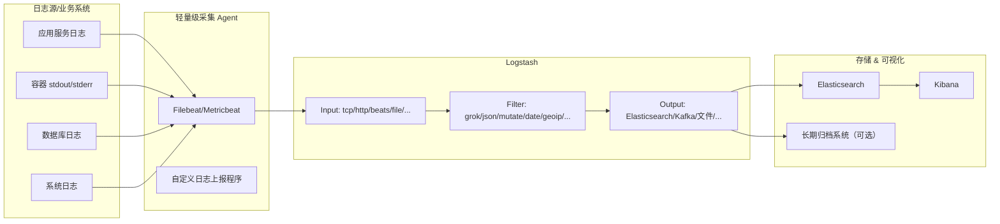
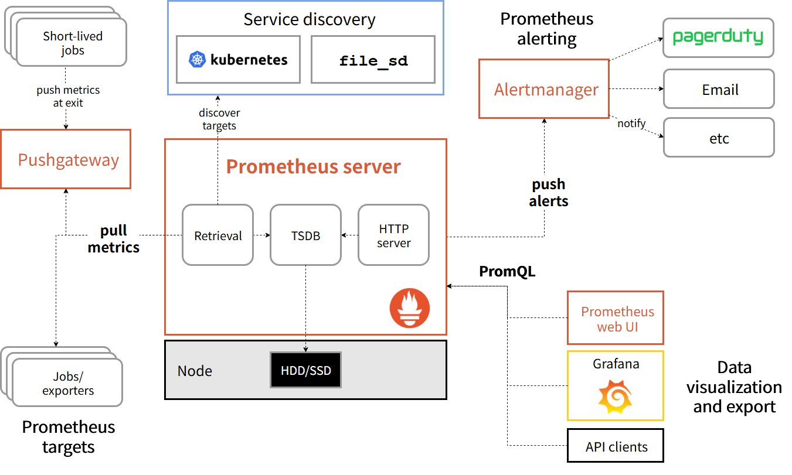

作为一名后端工程师，当业务上线后，持续监控服务的健康状态与性能指标是必不可少的环节。比如，监控 API 的请求延迟、错误率，数据库的连接数与查询性能，服务器的 CPU 和内存使用情况等，都是保障系统稳定运行的重要指标。在现代软件系统中，监控是保证可靠性、性能和可观测性的基础。通过监控，团队可以：

- 实时发现问题并快速定位故障来源；
- 监控服务的性能与资源使用以便于容量规划；
- 把技术指标与业务指标结合，评估功能对用户与业务的影响；
- 驱动自动化响应（告警、自动缩放、回滚等）。

从技术/服务角度常关注的指标包括请求延迟、错误率、吞吐量（QPS）、CPU/内存/磁盘/网络等；从业务角度关注 PV/UV、转化率、订单率等关键业务指标。一个健全的监控体系应当同时覆盖基础设施指标与业务指标，并支持告警、可视化与长期查询。

## 传统监控方式

要判断线上接口的状态，最简单的方式就是记录日志，比如http状态码、响应时间等，然后通过日志分析工具进行离线统计与分析。这就是传统的系统级日志监控的逻辑，比如 ELK（Elasticsearch + Logstash + Kibana）方案：
> 应用输出日志 → Logstash 解析 → ES 索引 → Kibana 可视化查询

- Logstash 负责收集与解析日志；
- Elasticsearch 负责存储与索引日志数据；
- Kibana 提供可视化与查询界面。



但这些方法存在：

- 实时性差（离线处理导致响应延迟）；
- 可扩展性与维护复杂度高（大量脚本与管道）；
- 难以直接计算延迟分位数或高效聚合跨实例指标。

Prometheus 及其生态通过高效的时序存储、拉取式采集、多维标签模型与强大的查询语言（PromQL）解决了这些问题。

## Prometheus

Prometheus 是一个开源监控系统与时间序列数据库（TSDB），主要特性：

- 多维数据模型（metric name + labels）；
- 强大的查询语言 PromQL；
- 本地高效 TSDB 与块存储设计；
- 默认采用拉取（pull）采集，并通过 PushGateway 支持短期作业的推送；
- 与 Alertmanager 集成处理告警路由、抑制与通知；
- 丰富生态：node_exporter、cadvisor、Grafana、Thanos、Cortex 等。

Prometheus 非常适合微服务與容器化环境，并常与 Grafana 配合用于可视化。

### Prometheus 系统架构概览

一个典型的 Prometheus 系统包括：

| 分类        | 组件                                        | 用途               |
| --------- | ----------------------------------------- | ---------------- |
| **指标采集层** | Exporter、Client SDK、Pushgateway           | 采集系统和应用指标        |
| **监控核心层** | Prometheus Server、Service Discovery       | 抓取、存储、查询指标       |
| **告警层**   | Alertmanager                              | 管理与发送告警          |
| **可视化层**  | Grafana                                   | 展示数据图表、Dashboard |
| **扩展层**   | Thanos / Cortex / Mimir / VictoriaMetrics | 海量数据、长时存储、HA     |



首先，exporter 和 client SDK 负责将系统或应用的指标以 http 接口的形式暴露出来；Prometheus Server 定期拉取这些指标并存储在本地 TSDB 中；通过 PromQL 查询数据并生成图表或触发告警；Alertmanager 负责处理告警的路由与通知；Grafana 用于可视化展示监控数据；Thanos 或 Cortex 等组件用于扩展存储与查询能力。

> exporter：负责将系统或应用的指标以 Prometheus 格式暴露出来的组件，如 `node_exporter`（主机指标）、`blackbox_exporter`（网络探测）等。
> client SDK：应用程序中集成的库，用于定义和暴露自定义指标。
> Pushgateway：用于短期批处理作业推送指标的组件。

### Prometheus 数据模型与指标类型

**指标数据模型**主要由四部分组成：

```txt
例如：http_requests_total{job="api-server",instance="server1:8080",method="GET",code="200"} 1027
```

- **指标名称（Metric Name）**：标识具体的监控指标，如 `http_requests_total` 表示 HTTP 请求总数。
- **标签（Labels）**：键值对形式的附加信息，用于区分同一指标的不同维度，如 `method="GET"`、`code="200"` 等。
- **指标值（Value）**：具体的数值，如请求次数、延迟时间等。
- **时间戳（Timestamp）**：指标被 Prometheus Server 采集的时间点。

**Metric** 类型主要有四种：

| Metric 类型     | 特点                                  | 适用场景              | 优缺点                                          |
| ------------- | ----------------------------------- | ----------------- | -------------------------------------------- |
| **Counter**   | 单调递增，只能加不能减                         | 请求次数、错误次数、任务完成数   | ✔ 易懂稳定  ✘ 无法表示当前值                          |
| **Gauge**     | 可增可减，表示瞬时状态                         | 内存、CPU、队列长度、并发连接数 | ✔ 灵活  ✘ 容易被误用（短周期波动大）                      |
| **Histogram** | 将观测值按桶（bucket）分布统计，提供 `count`、`sum` | 请求延迟、请求大小等分布      | ✔ 可计算分位数（通过 PromQL）  ✔ 适合跨实例聚合  ✘ 需提前规划桶 |
| **Summary**   | 客户端侧计算分位数                           | 单机延迟分位数           | ✔ 本地实时分位数  ✘ 无法跨实例聚合，不推荐在分布式场景使用       |

上述所有指标计数结果均保存在服务的**内存**中，不会持久化到磁盘，Prometheus Server 定期拉取这些指标并存储在本地 TSDB 中。

/metrics接口暴露指标示例：

```text
# ===========================
# Counter 示例
# ===========================
# HELP http_requests_total 总请求数
# TYPE http_requests_total counter
http_requests_total{job="api-server",instance="server1:8080",method="GET",code="200"} 1027

# ===========================
# Gauge 示例
# ===========================
# HELP active_connections 当前活跃连接数
# TYPE active_connections gauge
active_connections{job="api-server",instance="server1:8080"} 134

# ===========================
# Histogram 示例
# ===========================
# HELP request_duration_seconds 请求延迟分布
# TYPE request_duration_seconds histogram
request_duration_seconds_bucket{job="api-server",instance="server1:8080",le="0.1"} 523
request_duration_seconds_bucket{job="api-server",instance="server1:8080",le="0.2"} 874
request_duration_seconds_bucket{job="api-server",instance="server1:8080",le="0.5"} 1192
request_duration_seconds_bucket{job="api-server",instance="server1:8080",le="1"} 1460
request_duration_seconds_bucket{job="api-server",instance="server1:8080",le="+Inf"} 1530
request_duration_seconds_sum{job="api-server",instance="server1:8080"} 247.39
request_duration_seconds_count{job="api-server",instance="server1:8080"} 1530

# ===========================
# Summary 示例
# ===========================
# HELP request_duration_summary_seconds 请求延迟分位数（客户端统计）
# TYPE request_duration_summary_seconds summary
request_duration_summary_seconds{job="api-server",instance="server1:8080",quantile="0.5"} 0.123
request_duration_summary_seconds{job="api-server",instance="server1:8080",quantile="0.9"} 0.245
request_duration_summary_seconds{job="api-server",instance="server1:8080",quantile="0.99"} 0.487
request_duration_summary_seconds_sum{job="api-server",instance="server1:8080"} 310.23
request_duration_summary_seconds_count{job="api-server",instance="server1:8080"} 1820
```

### 时序数据库 TSDB

Prometheus Server 从各个 Exporter 拉取指标数据后，存储在本地的时序数据库（TSDB）中。Prometheus 的 TSDB 设计目标是高效存储与查询时间序列数据，主要特点：

- **块存储（Block Storage）**：数据按时间块（block）存储，每个块包含若干时间序列数据，默认块大小为 2 小时。块内数据采用列式存储与压缩算法（如 Gorilla 压缩）以节省空间。
- **索引结构**：使用倒排索引（inverted index）加速标签查询，支持高效的标签过滤与聚合操作。
- **数据保留策略**：支持配置数据的保留时间（如 15 天），过期数据会被自动删除以节省存储空间。
- **查询优化**：通过内存缓存、预计算等手段提升查询性能。

### 时间序列数据模型

时间序列数据（Time Series Data）由以下两部分组成：

- **唯一标识（Identifier）**：由指标名称和可选的标签键值对组成。
- **Samples**：实际的数据点，包含一个 float64 类型的值（v）与一个 int64 类型的毫秒级时间戳（t）。


#### 时间序列的唯一标识

一个时间序列由以下两部分唯一确定：

```text
metric_name + 完整的 labelSet
```

> 只要任意标签不同，即使 metric name 一样，也是新的 time series。这是 Prometheus 多维数据模型的关键特性。

host=A                 → [1,3,4]
core=0                 → [3]

#### TSDB 内部组织结构

**seriesID**

每个唯一的 Identifier 会分配一个 seriesID，每条时间序列独立存储自己的 samples：

```text
(identifier) → [(t0,v0), (t1,v1), ...]
```

**postings（倒排索引）**

用于快速查找符合 label 条件的 seriesID，支持高效的标签过滤与聚合：

```text
metric=cpu_usage → [1,2,3,4]
host=A → [1,3,4]
core=0 → [3]
```

查询时执行 postings 的交集，得到所需的 seriesIDs。

host=A → [1,3,4]

#### PromQL 查询与 TSDB 行为

**按标签过滤**

```promql
cpu_usage{host="A"}
```

TSDB 执行 postings 交集：

```text
metric=cpu_usage → [1,2,3,4]
host=A → [1,3,4]
→ 匹配 [1,3,4]
```

**按维度聚合**

```promql
sum(cpu_usage{host="A"}) by (host)
```

TSDB 先获取所有匹配的 series（1/3/4），按时间戳对齐后求和。

**复杂过滤**

```promql
http_requests_total{method="GET", status="200"}
```

执行 postings 交集后只匹配对应的 series。


#### 关键要点与最佳实践

- 相同 metric name + 不同 labels → 完全不同的 time series
- TSDB 使用倒排索引（postings）加速标签查询
- PromQL 聚合的三个关键步骤：
        1. 获取所有匹配的 series
        2. 按 timestamp 对齐
        3. 计算聚合结果
- 高基数问题：label 越多 → series 数量可能爆炸，影响性能与存储成本

### PromQL 查询语言

#### 1. PromQL 的核心执行原则

**原则一：函数先作用于每条时间序列**

例如：

```promql
rate(http_requests_total[1m])
```

每个 instance / pod 的序列分别计算 QPS。

**原则二：聚合函数（sum / avg / by）再把这些序列按 label 合并**

例如：

```promql
sum(rate(http_requests_total[1m])) by (method)
```

先对每个实例执行 rate，再按 method 聚合。

---

#### 2. PV（页面访问量）

**过去 5 分钟 PV（counter 增量）**

```promql
increase(http_requests_total[5m])
```

每条序列单独算 PV 增量（每个实例一条）。

**总 PV**

```promql
sum(increase(http_requests_total[5m]))
```

所有实例的 PV 相加，得到全服务 PV。

**按 path 聚合**

```promql
sum(increase(http_requests_total[5m])) by (path)
```

---

#### 3. QPS（Queries Per Second）

**每个实例的 QPS**

```promql
rate(http_requests_total[1m])
```

不加 sum 时，每条序列独立算 QPS（可用于排查实例负载）。

**总 QPS**

```promql
sum(rate(http_requests_total[1m]))
```

先 rate，再 sum 聚合为一条序列。

**按 method 聚合的 QPS**

```promql
sum(rate(http_requests_total[1m])) by (method)
```

---

#### 4. P80 耗时（Histogram）

原始指标：`request_duration_seconds_bucket{le="0.1", ...}`

**每实例自己的 P80**

```promql
histogram_quantile(0.80,
    rate(request_duration_seconds_bucket[5m])
)
```

rate 对每个 bucket 每条序列独立计算，quantile 得到每实例的 P80。

**全服务的 P80（常用）**

```promql
histogram_quantile(0.80,
    sum(rate(request_duration_seconds_bucket[5m])) by (le)
)
```

先 rate，按 le 聚合所有实例的 bucket，重建整体分布并求 p80。

---

> **PromQL 的核心：先计算 rate/increase/histogram_quantile → 再按 label 进行聚合**

---

### 可视化与告警 Grafana、Alertmanager

Grafana 是常用的可视化工具，支持多种数据源（Prometheus、InfluxDB、Elasticsearch 等）。通过 Grafana，可以创建丰富的 Dashboard，展示各种监控指标与图表。

Alertmanager 负责处理 Prometheus 触发的告警，支持告警抑制、分组与路由，并可通过邮件、Slack、钉钉等多种方式发送通知。

## Prometheus 实践指南

参考阅读：[Prometheus 快速入门教程](https://yunlzheng.gitbook.io/prometheus-book/parti-prometheus-ji-chu/quickstart/prometheus-quick-start)


## TODO

 - [ ] Prometheus 时序数据库的设计与实现细节


## 参考与延申阅读

- 官方文档：[https://prometheus.io/docs/](https://prometheus.io/docs/)
- PromQL 教程：[https://prometheus.io/docs/prometheus/latest/querying/basics/](https://prometheus.io/docs/prometheus/latest/querying/basics/)
- Thanos / Cortex：长期存储与扩展方案
- Prometheus-book：[https://yunlzheng.gitbook.io/prometheus-book](https://yunlzheng.gitbook.io/prometheus-book)
- Prometheus TSDB 的设计与实现：[https://tech.qimao.com/prometheus-tsdb-de-she-ji-yu-shi-xian-2/](https://tech.qimao.com/prometheus-tsdb-de-she-ji-yu-shi-xian-2/)


